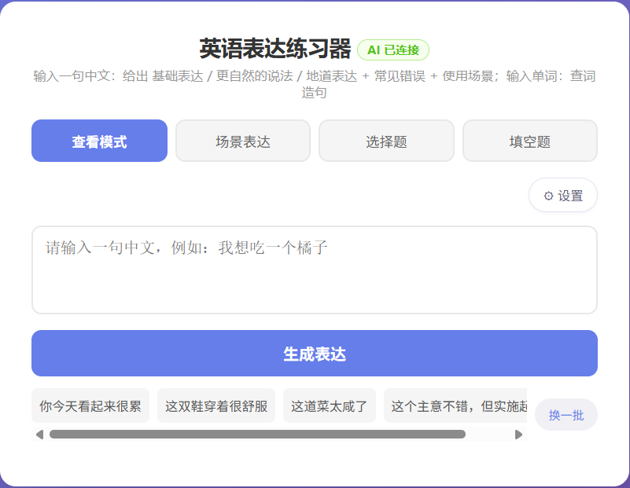

# 英语表达练习器 - 使用文档 📚

## 📖 简介

英语表达练习器是一个智能英语学习工具，通过 AI 技术帮助你学习地道的英文表达。支持选择题、填空题、查看三种模式，让学习更有趣、更高效。

---

## 🎯 核心功能

### 1. 三种练习模式

#### 📝 选择题模式
- 系统生成 4 个中文短语/句子
- 每个提供 3 个英文表达选项（最佳/可接受/错误）
- **悬停翻译**：鼠标悬停选项时显示关键词的中文释义
- 实时反馈语感等级和详细解释

#### 🎪 填空题模式
- 从 AI 生成的英文句子中挖空关键单词
- 提供多个单词选项供选择
- **悬停提示**：鼠标悬停单词时显示中文意思
- 填入答案后显示完整句子和解释

#### 👀 查看模式
- 直接浏览所有英文表达
- 查看每个表达的语感等级
- 适合快速复习和对比学习

### 2. 智能功能

- **AI 生成**：接入 DeepSeek API，自动生成地道英文表达
- **双向识别**：
  - 中文输入 → 生成英文表达
  - 英文输入 → 翻译为中文并生成表达
- **语音朗读**：支持英文句子发音（男声/女声可选）
- **本地代理**：支持配置代理，解决网络访问问题
- **悬停翻译**：实时显示关键词中文释义

---

## 🚀 快速上手

### 第一步：打开应用

直接在浏览器中打开 `index.html` 文件即可使用。



### 第二步：配置 API Key

1. 点击右上角的 **⚙️ 设置** 按钮
2. 在 **DeepSeek API** 标签页中输入你的 API Key
   - 获取地址：https://platform.deepseek.com/
3. 如需使用代理，勾选 **启用本地代理** 并配置代理地址
4. 点击 **保存设置**


### 第三步：开始练习

#### 使用选择题模式

1. 在输入框中输入中文短语，例如：
   ```
   外面下雨了，记得带伞
   ```

2. 点击 **生成题目** 按钮

3. 系统会生成 4 个中文短语，每个提供 3 个英文选项：
   - ✅ **最佳表达**：最地道、最自然的英文
   - ⚠️ **可接受表达**：语法正确但不够地道
   - ❌ **错误表达**：不恰当或有语法问题

4. **悬停查看释义**：将鼠标悬停在选项上，可以看到关键词的中文释义
   ```
   悬停 "take" → 显示：take - 拿；携带
   悬停 "bring" → 显示：bring - 带来；拿来
   ```

5. 点击你认为最地道的选项

6. 查看答案和详细解释

#### 使用填空题模式

1. 切换到 **填空题** 标签

2. 输入中文短语，例如：
   ```
   我昨天去图书馆了
   ```

3. 点击 **生成题目** 按钮

4. 系统会显示带空格的英文句子：
   ```
   I ___ to the library yesterday.
   ```

5. **悬停查看释义**：将鼠标悬停在候选单词上，查看其中文意思
   ```
   悬停 "went" → 显示：went - 去（go 的过去式）
   悬停 "go" → 显示：go - 去；走
   ```

6. 点击选择正确的单词填入空格

7. 查看完整句子和解释


#### 使用查看模式

1. 切换到 **查看** 标签

2. 输入中文短语

3. 点击 **查看表达** 按钮

4. 浏览所有生成的英文表达及其等级说明

---

## ⚙️ 详细设置

### DeepSeek API 设置

| 选项 | 说明 |
|------|------|
| **API Key** | 从 [DeepSeek 官网](https://platform.deepseek.com/) 获取的密钥 |
| **启用本地代理** | 如果无法直连 DeepSeek，勾选此项 |
| **代理地址** | 本地代理服务地址，如 `http://localhost:8080` |

#### 获取 API Key 步骤：
1. 访问 https://platform.deepseek.com/
2. 注册并登录账号
3. 进入 API Keys 页面
4. 创建新的 API Key
5. 复制密钥并粘贴到设置中

### 语音设置

| 选项 | 说明 |
|------|------|
| **启用语音** | 开启/关闭英文句子发音 |
| **语音速度** | 调整播放速度（0.5x - 2x） |
| **语音角色** | 选择男声或女声 |

### 高级选项

| 选项 | 说明 |
|------|------|
| **演示题库** | 未配置 API Key 时使用的示例题目 |
| **刷新生成** | 从题库中随机抽取新题目 |

---

## 💡 使用技巧

### 学习建议

1. **循序渐进**
   - 第一遍：使用选择题模式，理解不同表达的差异
   - 第二遍：使用填空题模式，加深对单词搭配的记忆
   - 第三遍：使用查看模式，复习所有表达

2. **充分利用悬停翻译**
   - 不确定某个词的意思时，先悬停查看
   - 对比不同选项中关键词的差异
   - 理解为什么某个词更地道

3. **定期练习**
   - 每天练习 4-5 个短语
   - 重点关注容易混淆的表达
   - 记录自己常犯的错误

4. **使用语音功能**
   - 跟读 AI 朗读的句子
   - 注意发音和语调
   - 培养语感

### 实用示例

#### 示例 1：携带物品的表达

**中文**：外面下雨了，记得带伞（提示：指随身携带）

**英文选项**：
- ✅ **最佳**：It's raining outside. Remember to **take** an umbrella.
  - 悬停 "take" 显示：take - 拿；携带
  - 解释：take 强调随身携带，最自然
  
- ⚠️ **可接受**：It's raining outside. Remember to **bring** an umbrella.
  - 悬停 "bring" 显示：bring - 带来；拿来
  - 解释：bring 强调带到某地，不够准确
  
- ❌ **错误**：It's raining outside. Remember to **carry** an umbrella.
  - 悬停 "carry" 显示：carry - 搬运；携带
  - 解释：carry 强调搬运重物，用在雨伞上不自然

#### 示例 2：时态的使用

**填空题**：我昨天去图书馆了

**完整英文**：I ___ to the library yesterday.

**单词选项**：
- go（悬停显示：去；走）
- goes（悬停显示：去（第三人称单数）
- going（悬停显示：去；正在去）
- **went** ✓（悬停显示：去（过去式））

**解释**：yesterday 表示过去时间，需要用过去式 went

---

## 🔧 故障排除

### 问题 1：无法生成题目

**可能原因**：
- 未填写 API Key
- 网络连接问题
- API Key 已过期

**解决方法**：
1. 检查是否填写了正确的 DeepSeek API Key
2. 如果在国内，尝试启用本地代理
3. 检查 API Key 是否有效（登录 DeepSeek 官网确认）
4. 查看浏览器控制台是否有错误信息

### 问题 2：语音播放没有声音

**可能原因**：
- 浏览器禁用了音频
- 系统音量关闭
- 浏览器不支持 Web Speech API

**解决方法**：
1. 确保浏览器允许音频播放
2. 检查系统音量设置
3. 尝试刷新页面
4. 切换不同的语音角色
5. 使用 Chrome/Edge 浏览器（兼容性最好）

### 问题 3：悬停翻译不显示

**可能原因**：
- 鼠标移动过快
- 浏览器渲染问题

**解决方法**：
1. 将鼠标缓慢悬停在选项上
2. 刷新页面重试
3. 检查浏览器是否启用了 JavaScript

### 问题 4：代理配置不生效

**可能原因**：
- 代理地址填写错误
- 代理服务未启动

**解决方法**：
1. 确认代理地址格式正确（如 `http://localhost:8080`）
2. 确保本地代理服务已启动
3. 测试代理是否能访问外网
4. 查看浏览器控制台的网络请求

---

## 📱 浏览器兼容性

| 浏览器 | 支持情况 | 备注 |
|--------|---------|------|
| Chrome | ✅ 完全支持 | 推荐使用 |
| Edge | ✅ 完全支持 | 推荐使用 |
| Firefox | ✅ 完全支持 | - |
| Safari | ✅ 完全支持 | - |
| 移动浏览器 | ✅ 支持 | 已优化触屏体验 |

---

## 🎓 学习路径建议

### 初学者（英语基础薄弱）

1. **第 1 周**：每天使用查看模式浏览 5-10 个表达
2. **第 2-3 周**：开始使用选择题模式，重点理解最佳表达
3. **第 4 周**：尝试填空题模式，加深记忆

### 中级学习者（有一定基础）

1. 直接使用选择题模式，关注可接受和最佳表达的区别
2. 每天练习 5-10 个短语
3. 定期复习错题

### 高级学习者（希望提升地道度）

1. 使用填空题模式挑战自己
2. 重点关注语感等级的解释
3. 对比不同表达的细微差别
4. 尝试创造自己的表达并验证

---

## 📊 数据与隐私

- 所有设置和学习记录保存在浏览器本地（LocalStorage）
- API Key 仅存储在本地，不会上传到任何服务器
- 生成的题目通过 DeepSeek API 处理，遵循其隐私政策
- 清除浏览器数据会删除所有本地记录

---

## 🔗 相关链接

- DeepSeek 官网：https://platform.deepseek.com/
- GitHub 仓库：[您的仓库地址]
- 问题反馈：[GitHub Issues 地址]

---

## 📄 许可证

MIT License

---

**祝你学习愉快，快速掌握地道英文表达！** 🎉
