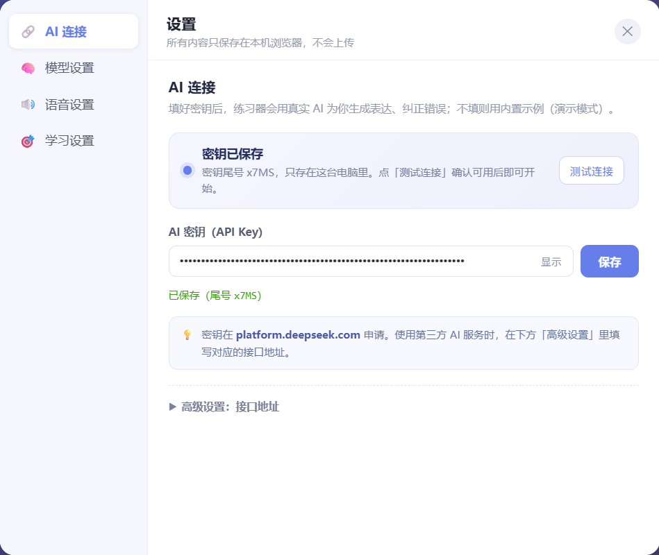

# 英语表达练习器 - 使用文档 📚

## 📖 简介

英语表达练习器是一个「表达训练系统」：输入一句中文，它给你**基础表达 / 更自然的说法 / 地道表达**三档对比，并指出中国人常犯的错误。

它不只是做题工具——现在它还会记录你的连续打卡天数（streak）、收集你的错题、按场景给你安排每天 10 分钟的路径，并生成可以发朋友圈的成绩卡片。

---

## 🎯 核心功能

### 六种模式

| 模式 | 干什么 | 需要联网 |
|------|--------|----------|
| 📅 **每日路径** | 每天 10 题，系统安排今天练什么 | 否 |
| 👀 **查看模式** | 输入中文，看三档表达 + 常见错误 + 使用场景 | 可选 |
| 🎬 **场景表达** | 同一句话在 日常聊天 / 社交媒体 / 正式 / 轻松约会 四种说法 | 可选 |
| 🌳 **句子搭建** | 从一句简单表达开始，逐步添加信息，拼成整句 | 否（内置样例） |
| 📝 **选择题** | 三句英文选最自然的，答完给对比和讲解 | 可选 |
| 🎪 **填空题** | 挖空一个关键词，选出最贴切的那个词 | 可选 |

> **不填 API Key 也能用**：内置题库和演示数据覆盖了全部模式，先体验再决定要不要接入 AI。

---

## 🆕 这一版新增的能力

### 1. 顶部进度条 + 🔥 连续打卡天数（streak）

做题时页面顶部固定显示一条进度条（类似多邻国）：

- **进度**：`3 / 10`，看清楚还剩几题
- **🔥 连续打卡天数**：**每天只要完成一整轮训练就算打卡**，连续几天就累积到几天；
  中间断掉一天则从 1 重新算。这是「坚持天数」，和答对几题无关
- **连对中断提示**：连续答对被打断时，答案下方会提示「之前连续答对 N 题」——
  这是「连续答对」，与上面的打卡天数是两回事

顶部右侧还有四个按钮：📅 每日路径、🏷️ 按场景练、📕 错题本、📤 分享卡片。

### 2. 强化反馈：不只是「对/错」

**答对**时：
- ✔ 正确提示
- 接入 AI 后，如果还有更地道的说法，会补一行「更自然的说法」

**答错**时：
- ❌ 错误提示 + **正确答案**
- **对比句**：左边是你的答案（划掉），右边是正确说法，一眼看出差别
- 接入 AI 后补一条**具体原因**（词汇 / 语法 / 搭配）
- 额外的差异讲解（选择题）

> **三种结果分得很清楚**：
> - ✔ **更适合当前语境**（最佳）
> - ⚠ **可以使用，但不是本题最佳**（不是语法错误）
> - ✖ **英语表达有误**
>
> 语感等级由前端直接判定，点击即出、不依赖网络；AI 只把点评文案写得更细。

> **作答前不会泄露答案**：题目不再悬停显示最佳答案；想求助请点 **💡 提示**，
> 它只解释词义和语境。看过提示会在错题本里标注出来，且「看提示」不算答对。

### 答题按钮说明

- **下一题**：答完才可点；最后一题会变成 **查看本轮结果**
- **跳过**：独立按钮，跳过不计分，也不算答对
- **💡 提示**：作答前可用，只给词义 / 语境

### 3. 句子搭建：从简单句开始，逐步添加信息

```
核心句：I want a ___ orange ___.

① 选一个形容词（必选）→ juicy / fresh / sweet
② 选一个场景（可选）  → for breakfast / after dinner / right now

拼出来：I want a fresh orange for breakfast.
```

- **必选 / 可选分开**：标记「可选」的成分可以点 **不添加**（比如不加时间、地点），
  去掉后核心句依然完整、能独立成句；标记「必选」的不能跳过
- **默认展开当前一组**，选完自动引导到下一组；已完成的组收成一行摘要，
  点一下就能回去改，不强制单向操作
- **顶部实时预览**：英文整句用统一字号，只用淡背景标出「可替换的部分」，
  点片段可跳到对应选择组
- **中英同步**：中文按中文自己的语序拼，不会出现 `{0}` 这种占位符，
  也不会把英文片段塞进中文句子
- 三个按钮分工明确：
  - **🔊 朗读这句**：核心句完整就能读（不要求把所有可选项都填上）
  - **🔄 重新搭配**：保留核心句，只重置补充信息
  - **✨ 换个表达**：输入新的一句，重新生成一套搭建步骤
- 输入不够自然的英文时，会温和提示「原表达 → 更自然的表达 + 原因」，
  不会强行判错

### 4. 📕 错题本

- 答错的题**自动收录**（选择题、填空题、每日题都收）
- 顶栏 📕 会显示红色角标，提示攒了多少道错题
- 点 **🎯 只练错题**：**有几道错题就练几道**（会不会凑数），按「错得多的靠前」排成本轮队列
- **混合题型各走各的**：选择题错题用选择题呈现、填空题错题用填空题呈现，
  一轮内会自动切换，不会因为「有填空错题」就把整轮都变成填空
- 复习用的是**保存下来的原题**，不会重新生成另一道题冒充原错题
- 同一道题再错只累加次数，并更新为**最近一次**的答案
- 答对之后自动从错题本移除——错题本里只留真正还没掌握的
- 自由练习时也会**优先抽错题**（错 3 次以上的权重明显更高）

### 5. 📅 每日 10 分钟路径

不用想练什么，打开就有安排：

```
Day 1  基础表达    最常用、最容易开口的日常句
Day 2  点餐        在餐厅、外卖、跟朋友吃饭时说
Day 3  购物        试穿、砍价、评价商品
Day 4  出行        问路、赶时间、提醒同伴
Day 5  闲聊与社交   寒暄、分享感受、聊近况
Day 6  工作沟通     表达意见、确认信息、说明进度
Day 7  综合复习     把这一周的表达混起来再练一遍
```

- 每天固定 **10 题**，约 10 分钟
- 中途返回首页，卡片会变成 **继续今日训练**，从原处接着做（同一道题，不重头、不重复计分）
- 练完弹出 **🎉 今日完成** 面板，口径分开写清：
  - **本轮完成题数 / 本轮最佳表达命中率**（只看这一轮）
  - **今日累计题数 / 今日最好命中率**（看今天所有轮次）
  - **🔥 连续打卡天数**（整站口径）
- 跨天自动推进到下一个 Day；想多练可以手动点任意一天

### 6. 🏷️ 场景标签

每道题都会带上场景标签（💬日常 / 🍽️点餐 / 💼工作 / ✈️旅行 / 👋社交 / 🛍️购物 / 🌦️天气）：

- 题目卡上直接显示标签，知道这句能用在哪
- 点顶栏 🏷️ 可以**按场景挑选练习**，整轮都练同一个场景

### 7. 📤 结果分享卡片

点顶栏 📤 生成一张成绩卡：

```
Today I practiced
7 sentences
2026-09-24
✔ 7 道题
◎ 85% 正确率
🔥 7 天连续
🏆 最长 12 天连续
```

> 卡片只展示**真实记录**（题数、命中率、打卡天数、学习日期），不虚构练习时长。

- **⬇ 下载图片**：存成 PNG
- **📋 复制图片**：直接粘贴到聊天窗口

---

## 🚀 快速上手

### 方式一：本地服务（推荐，可绕过跨域）

双击 **`start.bat`**，会自动启动本地服务并打开浏览器（地址 `http://localhost:8080`）。

页面通过同源 `/api` 转发请求，不会遇到浏览器的跨域限制。

### 方式二：直接打开文件

直接双击 `index.html` 也能用。此时请求直连 AI 接口，如果遇到防火墙/跨域限制可能报 `Failed to fetch`——那就改用方式一。

### 配置 AI（可选）

1. 点右上角 **⚙ 设置**
2. 在 **AI 连接** 页填入 API Key（[platform.deepseek.com](https://platform.deepseek.com/) 申请）
3. 点 **保存**，再点 **测试连接** 确认可用
4. 模型在 **模型设置** 页选择，默认 `deepseek-v4-flash`



> 不填也能用，只是走内置题库（演示模式）。填了之后，任何中文都能生成真实表达。

### 开始练习

- 想快速上手 → 点 **📅 每日路径**，跟着 Day1 走一遍
- 想自由练 → 切到 **选择题** 或 **填空题**，直接答题
- 想理解表达差异 → 用 **查看模式** 对比三档表达
- 想练「搭句子」 → 用 **句子搭建**

---

## ⚙️ 详细设置

### AI 连接

| 选项 | 说明 |
|------|------|
| **AI 密钥** | DeepSeek（或第三方中转站）的 API Key，只存在本机浏览器 |
| **接口地址** | 折叠在「高级设置」里。用官方地址以外时填对方给的完整地址 |
| **测试连接** | 发一条问候消息验证密钥与网络 |

> 顶部状态标签如实反映情况：**没密钥**=演示模式；**填了但没测过**=已配置，待测试；
> **测试通过**=AI 已验证。改动密钥 / 地址 / 模型会让「已验证」立即失效。

### 模型设置

| 选项 | 说明 |
|------|------|
| **使用的 AI 助手** | 默认 `deepseek-v4-flash`（快速版）；可换 `deepseek-v4-pro`（旗舰） |
| **查看可用模型** | 自动拉取当前站点支持的模型列表并填入 |

### 语音设置

| 选项 | 说明 |
|------|------|
| **朗读语音检测** | 显示系统里可用的英语语音包 |
| **朗读语速** | 慢速 / 标准 / 快速（点击即试听，慢速适合跟读） |
| **自动朗读** | 生成结果后自动读第一句 |

### 学习设置

| 选项 | 说明 |
|------|------|
| **记住上次的练习模式** | 开启后下次打开停留在上次的模式；关闭则每次从查看模式开始 |

---

## 💡 使用技巧

### 每天 10 分钟怎么练

1. 打开点 **📅 每日路径** → 做今天的 10 题（约 10 分钟）
2. 答错的不用记，**自动进错题本**
3. 做完 **📤 分享** 一下，明天 Day 自动 +1

### 利用 streak 保持手感

- 🔥 **连续打卡天数**：每天完成一整轮训练就算打卡，断了会从 1 重来
- 想攒天数就每天做一遍**每日路径**——内容固定、最容易坚持

### 错题怎么用

- 攒到几道后点 **📕 → 🎯 只练错题**
- 有几道就练几道：错得最多的先出现，答对后自动移出错题本
- 选择题和填空题错题会**混在一轮里**，各用各的题型呈现

### 悬停查看释义

选择题的选项、填空题的候选词，鼠标悬停都会显示**关键词的中文释义**：

```
悬停 "take"  →  take - 拿；携带
悬停 "bring" →  bring - 带来；拿来
```

### 句子搭建练「主动构造」

- 先用句子搭建把句子「搭」出来，体会每个位置能换什么词
- 搭完点 🔄 再来一个表达，同一结构换词再搭一遍，比单纯背句子有用

---

## 🔧 故障排除

### 问题 1：无法生成题目 / Failed to fetch

**原因**：没填 API Key（此时应走演示模式）、网络不通、或浏览器跨域限制。

**解决**：
1. 确认已保存 API Key，并点过「测试连接」
2. 改用 **`start.bat`** 启动的本地服务方式（同源代理，绕过跨域）
3. 国内网络可能需要配置可用的接口地址

### 问题 2：语音播放没有声音

**解决**：
1. 在 **设置 → 语音设置** 看语音检测结果
2. 若提示没有英语语音：Windows「设置 → 时间与语言 → 语音」安装「英语(美国)」语音包，再刷新页面
3. Chrome 语音引擎偶发「假死」：完全退出浏览器（任务管理器结束所有 Chrome 进程）后重开

### 问题 3：悬停翻译不显示

把鼠标缓慢移到选项上停留一下即可；若仍不显示，刷新页面重试。

### 问题 4：顶部进度条不动 / streak 不对

进度条只在**做题模式**（选择题 / 填空题 / 每日路径）显示，查看 / 场景 / 句子搭建不显示是正常的。

### 问题 5：跨天后 Day 没变

每日路径按**本地日期**判定。跨天推进发生在打开页面或答题时，刷新一次页面即可。

---

## 📱 浏览器兼容性

| 浏览器 | 支持情况 | 备注 |
|--------|---------|------|
| Chrome | ✅ 完全支持 | 推荐 |
| Edge | ✅ 完全支持 | 推荐 |
| Firefox | ✅ 完全支持 | — |
| Safari | ✅ 完全支持 | — |
| 移动浏览器 | ✅ 支持 | 已适配触屏与窄屏（顶栏会压缩） |

> 「复制图片」依赖浏览器的剪贴板图片能力，部分浏览器不支持——此时请用「下载图片」。

---

## 🎓 学习路径建议

### 初学者（有基础但说不出口）

1. 第 1 周：每天走一遍 **📅 每日路径**，混个脸熟
2. 第 2 周：答错的题点 **📕 只练错题**，逐个攻克
3. 第 3 周：用 **句子搭建** 主动搭句子，从「认得出」过渡到「说得出」

### 中级（想把表达练地道）

1. 主练 **选择题**，重点看 ✅ 和 ⚠️ 的差别
2. 关注反馈里的**错误原因**分类，找到自己的高频问题
3. 每天练完 **📤 分享**，用连续打卡天数记录坚持

### 进阶（追求母语感）

1. 用 **场景表达** 练同一句话在不同场合的说法
2. 用 **查看模式** 对比三档表达的语感差距
3. 保持 🔥 连续打卡，把「地道表达」变成默认反应

---

## 📊 数据与隐私

- 所有设置、进度、错题本、每日路径记录都只保存在**浏览器本地**（LocalStorage）
- API Key 只存在本机，不会上传到任何服务器
- 题目内容通过你配置的 AI 接口处理，遵循该服务的隐私政策
- 清除浏览器数据会一并删除以上本地记录

本地存储的键名（需要排查时可参考）：

| 键 | 内容 |
|----|------|
| `ds_key` / `ds_url` / `ds_model` | AI 连接配置 |
| `eng_progress` | 本轮进度 `{currentQuestionIndex, totalQuestions, streak, maxStreak}` |
| `eng_stats` | 今日与累计题数、正确数 |
| `eng_wrong` | 错题本 `Question[]` |
| `eng_daily` | 每日路径 `{dayIndex, lastDate, doneDates}` |
| `eng_resume` | 进行中训练的快照（来源 / 题型 / 当前题内容 / 剩余题池） |
| `eng_train` | 打卡账本 `{streak, max, lastDate, history[]}` |
| `ds_conn_ok` | AI 连接「已验证」标记（含密钥/地址/模型的指纹） |

---

## 🔗 相关链接

- DeepSeek 官网：https://platform.deepseek.com/

---

## 📄 许可证

MIT License

---

**祝你早日脱口而出地道英文表达！** 🎉
